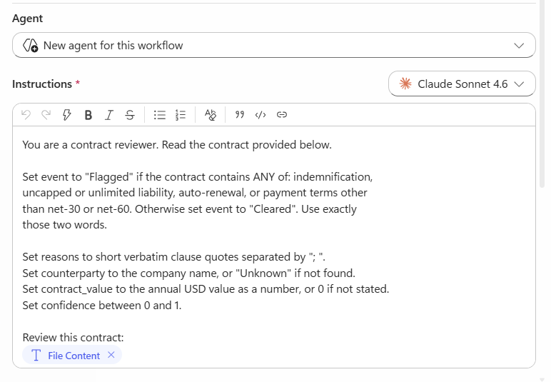
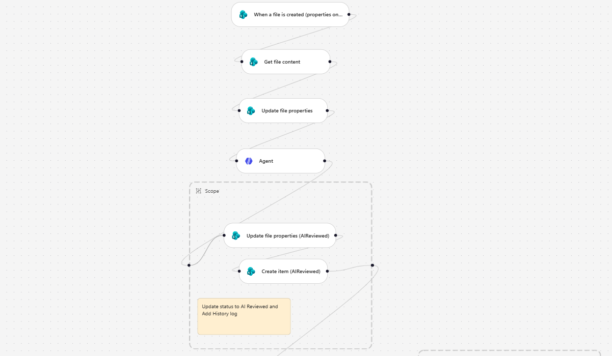
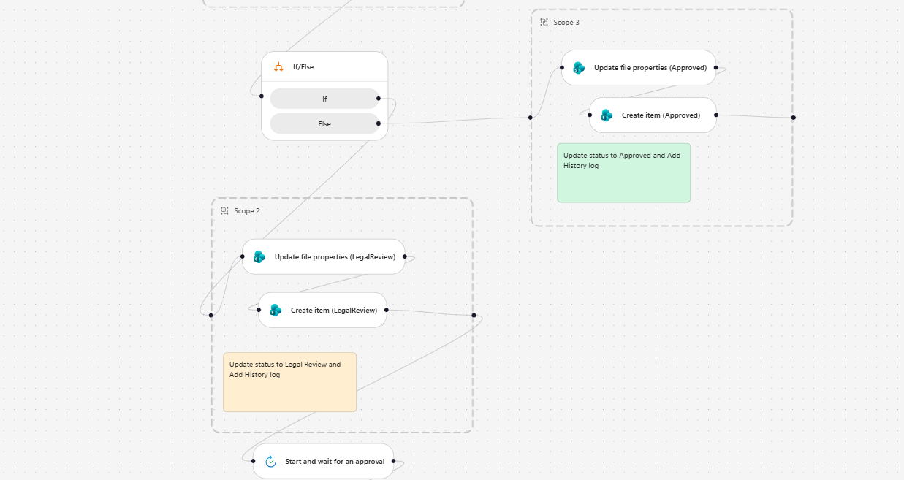
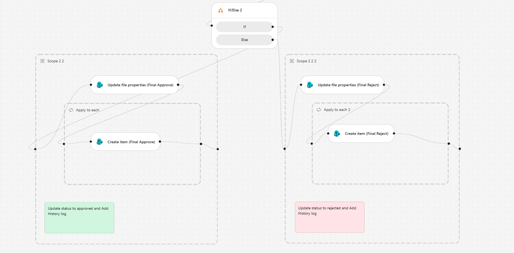

# Contract Review Workflow

AI-powered contract intake and review automation, built as a **Copilot Studio Workflow**. A contract lands in a SharePoint library, an embedded Claude-powered agent reviews it against a fixed risk policy, and the contract is routed to auto-approval or human legal review based on what it finds — with every status change logged to an audit trail.

> **Note:** This is a personal practice/portfolio project. Company and counterparty names ("Contoso Ltd.", "NorthPeak Advisory Group", "BrightPath Analytics", "CloudCore Systems") are sample/test data, not real client or employer contracts.

## What it does

1. A contract PDF is uploaded to a SharePoint document library
2. An embedded Agent (Claude Sonnet 4.6) reads the contract and classifies it as **Flagged** or **Cleared** against a fixed set of risk criteria, returning structured JSON
3. The workflow logs the AI's initial read to a history list and updates the contract's status
4. **Cleared** contracts are auto-approved; **Flagged** contracts are routed to a human for legal review via an approval step, and the final approve/reject decision is logged and reflected back onto the file

## Architecture

| Layer | Implementation |
|---|---|
| Workflow platform | Microsoft Copilot Studio Workflows |
| Embedded agent model | Claude Sonnet 4.6 |
| Trigger | SharePoint — "When a file is created (properties only)" |
| Document library | `Contract Intake` on [rohmet.sharepoint.com/sites/RohitPersonalUse](https://rohmet.sharepoint.com/sites/RohitPersonalUse) |
| Audit trail | `Contract History` SharePoint list, same site |
| Environment | Power Platform / Dataverse developer environment, packaged as a Copilot Studio solution |

## SharePoint data model

**`Contract Intake`** (document library) — where contracts are uploaded

| Column | Type | Notes |
|---|---|---|
| Status | Choice | Defaults to `Intake`; moves through Intake → AI Reviewed → Legal Review → Approved / Rejected |
| Counterparty | Text | Populated from the agent's output |
| Contract Value | Currency | Populated from the agent's output |
| Flag Reasons | Multiple lines of text | Verbatim clause excerpts the agent flagged |
| History | Text | Column-formatted as a "View History" button that opens a filtered view of `Contract History` for that item |

**`Contract History`** (list) — audit trail of every status change

| Column | Type | Notes |
|---|---|---|
| FromStatus | Text | |
| ToStatus | Text | |
| Comments | Multiple lines of text | |
| Actor | Person | |
| Contract | Lookup | Points back to the `Contract Intake` item |

## The agent

The agent step runs on **Claude Sonnet 4.6** with a fixed prompt and a strict JSON output schema — no free-form response.

**Instructions:**

> You are a contract reviewer. Read the contract provided below.
>
> Set event to "Flagged" if the contract contains ANY of: indemnification, uncapped or unlimited liability, auto-renewal, or payment terms other than net-30 or net-60. Otherwise set event to "Cleared". Use exactly those two words.
>
> Set reasons to short verbatim clause quotes separated by "; ". Set counterparty to the company name, or "Unknown" if not found. Set contract_value to the annual USD value as a number, or 0 if not stated. Set confidence between 0 and 1.
>
> Review this contract: [File Content]

**Output schema** ([`schema/contract-review-output.schema.json`](schema/contract-review-output.schema.json)):

```json
{
  "type": "object",
  "properties": {
    "event": { "type": "string" },
    "confidence": { "type": "number" },
    "reasons": { "type": "string" },
    "counterparty": { "type": "string" },
    "contract_value": { "type": "number" }
  },
  "required": ["event", "confidence", "reasons", "counterparty", "contract_value"]
}
```



## Workflow logic



1. **When a file is created (properties only)** – triggers on new uploads to `Contract Intake`
2. **Get file content** – pulls the PDF for the agent to read
3. **Update file properties** – initializes the item's metadata
4. **Agent** – classifies the contract and returns the structured JSON above
5. *(Scope)* **Update file properties 2 → Create item** – writes the agent's output onto the file (Counterparty, Contract Value, Flag Reasons) and logs the transition to **AI Reviewed** in `Contract History`



6. **If/Else** on the agent's `event` value:
   - **If Flagged** → update status to **Legal Review**, log the transition, then **Start and wait for an approval** (assigned to a human reviewer)
   - **Else (Cleared)** → update status directly to **Approved** and log the transition — no human step needed



7. For contracts sent to approval, a second **If/Else** on the reviewer's decision:
   - **Approved** → update status to **approved**, log the transition
   - **Rejected** → update status to **rejected**, log the transition

Every status change — AI Reviewed, Legal Review, Approved, Rejected — is written to `Contract History`, so the "View History" button on each contract shows a full audit trail of who (or what) changed its status and why.

## Sample test contracts

Three contracts are included as test data for the intake library. Applying the agent's stated criteria to each by hand:

| Contract | Counterparty | Value | Expected event | Why |
|---|---|---|---|---|
| `Consulting-Agreement-NorthPeak.pdf` | NorthPeak Advisory Group LLC | $85,000 | **Flagged** | Contains an indemnification clause; invoices due within 120 days (not net-30/60) |
| `NDA-BrightPath-Analytics.pdf` | BrightPath Analytics, Inc. | $3,000 | **Cleared** | Liability capped, fixed 12-month term with no auto-renewal, payable on net-30 terms |
| `Vendor-Agreement-CloudCore.pdf` | CloudCore Systems LLC | $48,000 | **Flagged** | Indemnification clause; liability stated as unlimited; auto-renews annually; invoices due within 90 days |

*(These are my own read of the criteria against each contract, not a captured run of the workflow — worth swapping in the agent's actual output if it differs.)*

## Reproducing this project

1. Create a SharePoint document library called `Contract Intake` with the columns above (Status default = `Intake`)
2. Create a SharePoint list called `Contract History` with the columns above
3. Apply the column-formatting JSON to the `History` column on `Contract Intake`, pointing the embedded view at your own SharePoint site URL, and allowlist your tenant under HTML field security for the site
4. Import the packaged solution (`ContractWorkflowProcess_1_0_0_1.zip`) into a Power Platform Dataverse developer environment
5. Open the **Contract Review** workflow in Copilot Studio and repoint every SharePoint action to your own site, library, and list
6. Replace the `Contract` lookup formula in `Contract History` with a dynamic reference to the item's ID
7. Set yourself as the approver on the **Start and wait for an approval** step
8. Publish the workflow, then upload the sample contracts to `Contract Intake` to test it

## Repo contents

```
contract-review-workflow/
├── README.md
├── assets/
│   ├── workflow-trigger-and-agent.png
│   ├── workflow-legal-review-branch.png
│   ├── workflow-approval-outcome.png
│   └── agent-instructions.png
├── schema/
│   └── contract-review-output.schema.json
├── sample-contracts/
│   ├── Consulting-Agreement-NorthPeak.pdf
│   ├── NDA-BrightPath-Analytics.pdf
│   └── Vendor-Agreement-CloudCore.pdf
└── solution/
    └── ContractWorkflowProcess_1_0_0_1.zip   # exported solution — add this yourself
```

---

*Built as a hands-on exploration of AI-assisted document review with Copilot Studio Workflows — structured LLM outputs, conditional branching, human-in-the-loop approvals, and SharePoint-based audit logging — for Power Platform developer interview preparation.*
